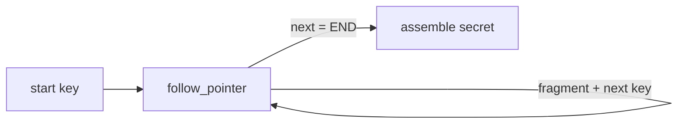
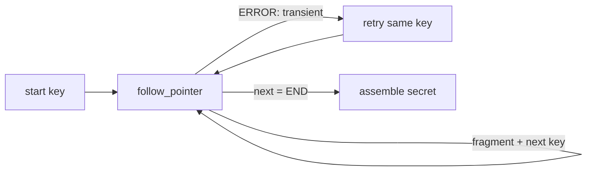
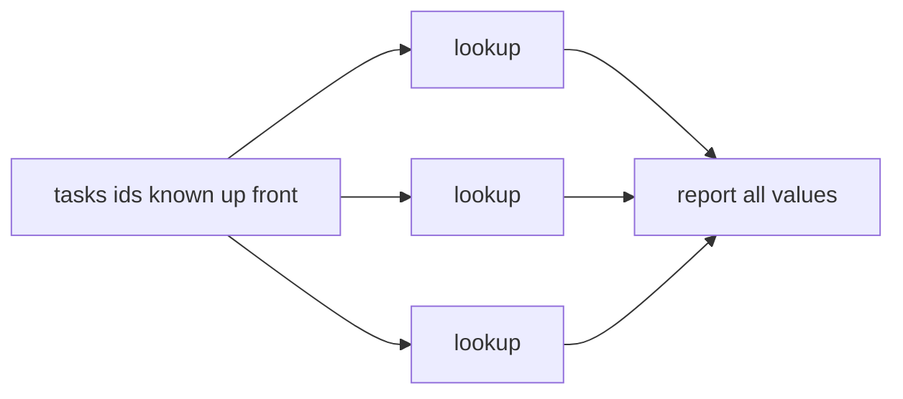

# Agent Benchmarks

Executable benchmarks that score an LLM-driven agent's tool-calling behavior against known,
seeded ground truth — no LLM judge. Each script builds a hidden task, runs a zsmith `Agent`
against it, and prints a one-line result. The benchmarks target **orthogonal axes** so their
results can disagree: a model can pass one and fail another.

## Results

Every run prints exactly one normalized markdown table row on stdout — same columns for
every benchmark — and copies it to the system clipboard, so after a run the row pastes
directly into this table. Failure details and extra signals go to stderr, never into the
row. In a sweep each run overwrites the clipboard, so copy the sweep's rows from the
terminal instead.

| Benchmark | Model | Size | Calls | Turns | Result |
|-----------|-------|------|-------|-------|--------|
| loop | claude-opus-4-8 | 50 | 50 | – | PASS |
| parallelism | claude-opus-4-8 | 8 | 8 | 1 | PASS |
| recovery | claude-opus-4-8 | 3 | 12 | – | PASS |

- **Benchmark** — `loop` (pointer chasing), `parallelism` (parallel discrimination), or
  `recovery` (transient-fault recovery)
- **Model** — the model reported by the LLM responses: the one actually served, which can
  differ from the configured one (529 fallback, lightmetal's own config)
- **Size** — the task size knob: chain `depth` for loop, independent `tasks` for parallelism,
  injected `faults` for recovery
- **Calls** — total tool calls the agent issued
- **Turns** — agent turns that issued tool calls; the serial benchmarks do not track turns (`–`)
- **Result** — `PASS`/`FAIL`: secret match (loop, recovery), all values retrieved (parallelism)

A sweep appends ready-to-paste rows:

```
for d in 10 25 50 100 200; do ./agentLoopBenchmark $d; done
```

## Prerequisites

Java 25+, and a built zsmith. The scripts load `../zsmith/zbo/zsmith.jar` and `lightmetal.jar`,
so build first from the `zsmith/` directory:

```
cd ../zsmith && zb.sh
```

Inference runs in-process through LightMetal (the local model configured for zsmith); no API
key is required.

## agentLoopBenchmark — pointer chasing (loop-following)

Measures stamina at a long, *serial* tool loop. The agent starts with one key and calls
`follow_pointer` repeatedly — each result reveals the next key plus one fragment of a secret —
until the terminal marker, then reassembles the fragments in order. Each hop's key is read from
the previous result, so the walk has a **serial data dependency**: it cannot be parallelized or
predicted, forcing an ordered loop of exactly `depth` calls. One skipped or reordered hop
corrupts the secret.



```
./agentLoopBenchmark         # default depth 50
for d in 10 25 50 100 200; do ./agentLoopBenchmark $d; done
```

```
| loop | claude-opus-4-8 | 50 | 50 | – | PASS |
| loop | claude-opus-4-8 | 100 | 63 | – | FAIL |
```

Compare `Calls` to `Size`: more calls means the agent wandered or retried; fewer means it
stopped early (often narrating or hallucinating hops instead of calling the tool). Both are
loop-following failures. On `FAIL`, the expected/actual secret mismatch is printed to stderr.

## agentErrorRecoveryBenchmark — transient-fault recovery (robustness)

The same pointer chase as the loop benchmark — identical system prompt, identical tool
surface — but every third hop fails exactly once with
`ERROR: transient failure for key '…' — call again with the same key.` and succeeds on
retry. The only recovery cue is that error text: nothing in the prompt or the tool
description announces that failures can happen, so the benchmark measures whether the agent
**reads and reacts to tool errors**. Retrying continues the walk; giving up truncates the
secret; a fabricated fragment cannot match the seeded ground truth. `faults` is the size
knob, and the chain is `3 × faults` hops long so recovery is demanded repeatedly, spread
over the whole walk.



```
./agentErrorRecoveryBenchmark          # default 3 faults (9 hops)
for f in 2 4 8; do ./agentErrorRecoveryBenchmark $f; done
```

```
| recovery | claude-opus-4-8 | 3 | 12 | – | PASS |   # 9 hops + 3 retries — ideal
| recovery | claude-opus-4-8 | 3 | 5 | – | FAIL |    # gave up at the second fault
```

Ideal `Calls` = hops + faults: each fault costs exactly one retry. `recovered=X/faults` on
stderr shows how many injected failures were retried past; `Calls` well below hops + faults
means the agent abandoned the walk or hallucinated past an error — the mismatched secret
exposes both.

## agentParallelismBenchmark — parallel discrimination (independence)

The inverse axis. The agent is given `tasks` **independent** `id → value` pairs with every id
listed up front, so there is no data dependency. A `lookup` tool returns each value. An agent
that recognizes independence issues all calls in **one turn**; one that needlessly serializes
spreads them across `tasks` turns. The tool runs in parallel and gauges its own concurrency, so
the headline signal is `Turns` vs `Calls`, not a correctness match — `PASS` is only a gate
confirming all lookups were actually performed.



```
./agentParallelismBenchmark        # default 8 independent lookups
for k in 4 8 16 32; do ./agentParallelismBenchmark $k; done
```

```
| parallelism | claude-opus-4-8 | 8 | 8 | 1 | PASS |   # batched — ideal
| parallelism | claude-opus-4-8 | 8 | 8 | 8 | PASS |   # serialized
```

`Turns` near 1 means the agent batched the independent calls; `Turns` near `Size` means it
serialized them. The measured `maxConcurrency` is printed to stderr. A model whose provider
never emits multiple tool calls per turn reads as fully serial — a valid result, not a bug.

## Choosing a Model

### Pointing the harness at a candidate

The scripts fix their JVM flags in the shebang, so configure the model through properties
rather than the command line. `./app.properties` — meaning `benchmarks/app.properties`, since
that is the working directory — overrides `~/.zsmith/app.properties`, and a per-benchmark file
under the agent's own name overrides both: `pointer-chaser/`, `error-recoverer/`,
`parallel-worker/`.

```properties
# benchmarks/app.properties — served by lightmetal, which is on the scripts' classpath
lightmetal.model=<model>
```

`lightmetal.jar` sits on the class path of all three scripts, and whenever LightMetal can
resolve a chat implementation it takes precedence over `llm.provider` — the run logs
`lightmetal.jar on classpath — overriding llm.provider=…` when it does. To score a hosted
model instead, drop `lightmetal.jar` from the shebang's `--class-path` and configure the
provider:

```properties
llm.provider=claude
claude.model=claude-opus-4-8
```

Then check the **Model** column against what you configured. It reports the model that
answered, not the one you asked for, so a 529 fallback or a LightMetal-side default shows up
here — and a table row attributing a score to the wrong model is worse than no row.

### Match the axis to the workload

The three benchmarks are orthogonal by design, so there is no aggregate score to rank models
by. Pick the axis your agent actually exercises:

| Your agent | Decided by |
|------------|------------|
| Walks long serial chains — migrations, multi-step file edits, anything where step *n+1* depends on step *n* | `loop` |
| Calls the network, remote APIs, or any tool that fails and can be retried | `recovery` |
| Fans out over independent items — batch lookups, reading many files, per-item classification | `parallelism` |

A model that wins on one axis can lose on another. Score the axes you need and ignore the rest.

### Read the numbers, not the verdict

`Result` is a gate, not the measurement. The signal is in the counts:

- **loop** — `Calls` above `Size` means retries and wandering, which costs tokens. `Calls`
  below `Size` means hops were skipped or invented. Both read `FAIL`, but the second is the
  dangerous one: a model that fabricates a step it never took fails the same way on work
  where no seeded secret exists to catch it.
- **recovery** — ideal `Calls` is hops + faults. `recovered=X/faults` on stderr is the actual
  metric; a model recovering 1 of 3 faults is not a model to put behind a flaky API.
- **parallelism** — `Turns` near `Size` means every independent call took its own round trip.
  That is a latency and cost result, not a correctness one, and it may be the provider rather
  than the model: some never emit more than one tool call per turn.

### Benchmark at your size, more than once

The defaults are not your workload. Sweep the size knob and find where the model breaks —
passing `loop` at depth 50 and failing at 100 is a perfectly good model for chains shorter
than 50, and knowing that boundary is more useful than any single row.

```
for d in 10 25 50 100 200; do ./agentLoopBenchmark $d; done
```

The task is seeded, so the model is the only source of variance — which means a single `PASS`
near the breaking point tells you little. Repeat a run three to five times before trusting a
row at the edge; well inside the range, one run is enough.

### What this does not measure

Tool-calling behaviour only. Nothing here scores writing quality, knowledge, or judgement, and
a model that chases pointers perfectly may still be the wrong one to draft your text.

## Reproducibility

Every task is seeded, so a given size reproduces across runs; model non-determinism is the only
variance. Running both benchmarks on the same model is the point: pointer chasing forbids
parallelism, parallel discrimination rewards it, so the pair reveals whether a model can
parallelize when allowed.
