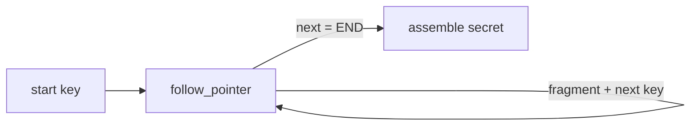

# Agent Benchmarks

Executable benchmarks that measure how well an LLM-driven agent follows long, sequential
tool-calling loops. Each script builds a hidden task with known ground truth, runs a zsmith
`Agent` against it, and scores the reply objectively (pass/fail), with no LLM judge.

## agentLoopBenchmark

Measures loop-following stamina via **pointer chasing**: the agent starts with one key and
must call `follow_pointer` repeatedly — each result reveals the next key plus one fragment of
a secret — until it reaches the terminal marker, then reassemble the fragments in order.

Because each hop's key is read from the previous tool result, the walk has a serial data
dependency: it cannot be parallelized or predicted, so the agent is forced into a genuine
ordered loop of exactly `depth` calls. One skipped or reordered hop corrupts the secret.



## Prerequisites

Java 25+, and a built zsmith. The scripts load `../zsmith/zbo/zsmith.jar` and
`lightmetal.jar`, so build first from the `zsmith/` directory:

```
cd ../zsmith && zb.sh
```

Inference runs in-process through LightMetal (the local model configured for zsmith); no API
key is required.

## Run

```
./agentLoopBenchmark         # default depth 50
./agentLoopBenchmark 100     # one chain of 100 hops
```

Sweep the depth to find where loop-following degrades:

```
for d in 10 25 50 100 200; do ./agentLoopBenchmark $d; done
```

## Output

```
PASS depth=50 toolCalls=50/50
FAIL depth=100 toolCalls=63/100 expected=... actual=...
```

- `PASS`/`FAIL` — whether the reconstructed secret matched the ground truth.
- `toolCalls=X/depth` — calls made vs. needed; `X > depth` means the agent wandered or
  retried, `X < depth` means it stopped early (often by narrating or hallucinating hops
  instead of calling the tool). Both are loop-following failures the benchmark surfaces.

The chain is seeded, so a given depth reproduces the same task across runs; model
non-determinism is the only source of variance.
